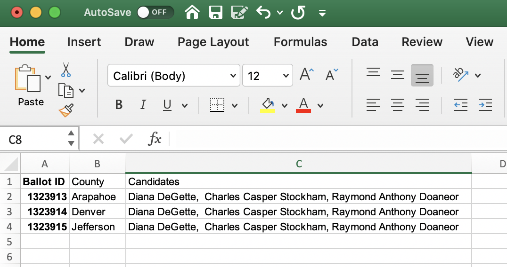
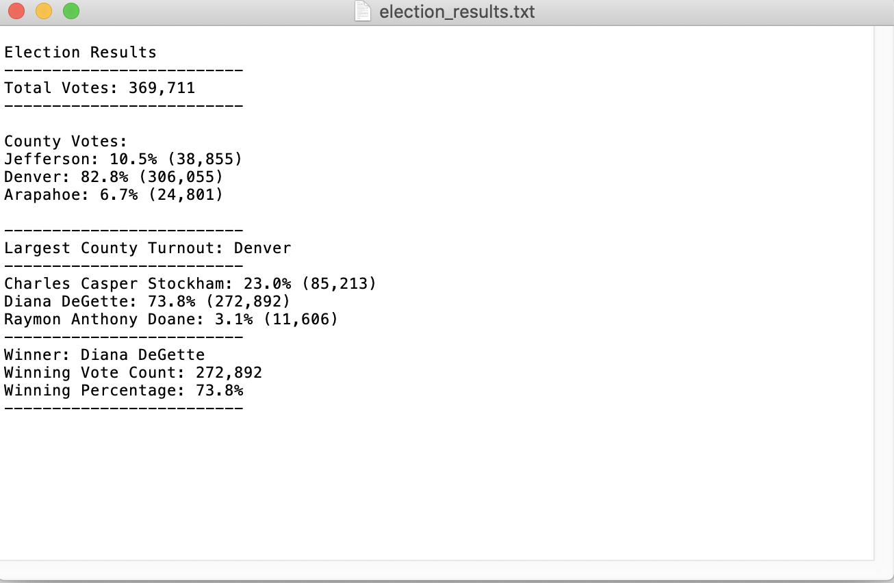

                 
                 
                 
             ANALYSIS OF CONGRESIONAL ELECTIONS IN THREE COUNTIES

 
PURPOSE

The purpose of this analysis is to show the preference of voters for a candiadate betwwen Diana DeGette, Charles Caspar Stockham, and Raymond Anthony Doaneor, for the elections in counties Arapahoe, Denver and Jefferson.

This table shows the three candidates who are running for the elections in three counties. Each voter has a voter identification in order to participate.

Analysis
The analysis was performed using the results of the congresional electios.

Looking at the reults we found that 369,711 voters participate in the congresional elections. The largest county with voters is  Denver county with 82.8% of the total voters, while Arapahoe county has the fewest voters with a 6.7% of the total voters. Jefferson county has more voters than Arapahoe county and o lot less voters than Denver county with 10.5% of the total voters.
 
Also we can see that Diana DeGette has the majority of votes 272,892, that corresponde to a 73.8% of the votes, while Charles Caspar Stockham got 85,213 votes that is a 23% of the votes, and Raymond Anthony Doaneor with the smaller amount of votes got 11,606 equivalent to a 3.1%. Thid means that the winner is Diana DeGette.

Conclusions

Diana DeGette won the congresional electios with the vote count of 369,711 corresponding to a 73.8% of the total votes,